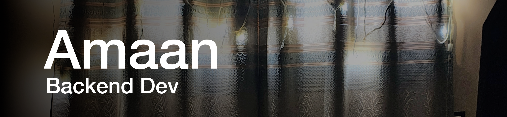

<a href="https://amaank404.github.io">![][Profile]</a>
<a href="https://bento.me/amaank404">![][BentoBadge]</a>
<a href="https://stackoverflow.com/users/14887424/amaank404">![][SOBadge]</a>

###### *Check out my [Bento](https://bento.me/amaank404) for more social links associated with me!*
###### I used arch btw
Hey there! I am Amaan, yet another self taught dev. I code 
during my freetime. Refer to me as he/him and my area of expertise mostly covers Python. I
know a couple more interesting things & languages around this domain.

![][PythonBadge]
![][HTML5Badge]
![][CSS3Badge]
![][JavascriptBadge]
![][SqlBadge]

I am familiar with tons of frameworks and libraries to build stuff around them though some might need a lil bit of revisiting.
Documentation is the key to learning something faster, it takes time to build the vocab for it but it was well worht it, 
learing any thing new is now a documentation and mini project away.

### Future Prospects

Learning is a long process, it requires consistency and discipline, and most importantly, time. Right now, it isn't the best
of this century for me to explore new sub domains, but I've certainly got a AI/ML on the track somewhere
down the line. As far as my current knowledge-base reaches out to, I've had scattered bit of know-how about everything there is
to CSE, eventually, I'll move on to specialise/master one of them.

Jack of all trades, master of none, often better than the master of one.

### Privacy Policy

* Please don't mention me in places where I am not involved!
* Respect my privacy

**I barely ever maintain this file, it might get outdated with time  
Last Updated on: 12 June 2025**

<!-- Framework Badges -->
[Profile]: https://img.shields.io/badge/Profile-D40000.svg?style=for-the-badge&logo=asciinema&logoColor=white
[ArchLinux]: https://img.shields.io/badge/Arch%20Linux-1793D1.svg?style=for-the-badge&logo=Arch-Linux&logoColor=white
[Blender]: https://img.shields.io/badge/Blender-E87D0D.svg?style=for-the-badge&logo=Blender&logoColor=white
[ClickUp]: https://img.shields.io/badge/ClickUp-7B68EE.svg?style=for-the-badge&logo=ClickUp&logoColor=white
[Debian]: https://img.shields.io/badge/Debian-A81D33.svg?style=for-the-badge&logo=Debian&logoColor=white
[Docker]: https://img.shields.io/badge/Docker-2496ED.svg?style=for-the-badge&logo=Docker&logoColor=white
[Fedora]: https://img.shields.io/badge/Fedora-51A2DA.svg?style=for-the-badge&logo=Fedora&logoColor=white
[FFMPEG]: https://img.shields.io/badge/FFmpeg-007808.svg?style=for-the-badge&logo=FFmpeg&logoColor=white
[Flask]: https://img.shields.io/badge/Flask-000000.svg?style=for-the-badge&logo=Flask&logoColor=white
[Git]: https://img.shields.io/badge/Git-F05032.svg?style=for-the-badge&logo=Git&logoColor=white
[Gimp]: https://img.shields.io/badge/GIMP-5C5543.svg?style=for-the-badge&logo=GIMP&logoColor=white
[Github]: https://img.shields.io/badge/GitHub-181717.svg?style=for-the-badge&logo=GitHub&logoColor=white
[GithubActions]: https://img.shields.io/badge/GitHub%20Actions-2088FF.svg?style=for-the-badge&logo=GitHub-Actions&logoColor=white
[Gnome]: https://img.shields.io/badge/GNOME-4A86CF.svg?style=for-the-badge&logo=GNOME&logoColor=white
[Inkscape]: https://img.shields.io/badge/Inkscape-000000.svg?style=for-the-badge&logo=Inkscape&logoColor=white
[IntelliJ]: https://img.shields.io/badge/IntelliJ%20IDEA-000000.svg?style=for-the-badge&logo=IntelliJ-IDEA&logoColor=white
[JQuery]: https://img.shields.io/badge/jQuery-0769AD.svg?style=for-the-badge&logo=jQuery&logoColor=white
[Jupyter]: https://img.shields.io/badge/Jupyter-F37626.svg?style=for-the-badge&logo=Jupyter&logoColor=white
[KaliLinux]: https://img.shields.io/badge/Kali%20Linux-557C94.svg?style=for-the-badge&logo=Kali-Linux&logoColor=white
[KDEPlasma]: https://img.shields.io/badge/KDE%20Plasma-1D99F3.svg?style=for-the-badge&logo=KDE-Plasma&logoColor=white
[KDenlive]: https://img.shields.io/badge/Kdenlive-527EB2.svg?style=for-the-badge&logo=Kdenlive&logoColor=white
[Keras]: https://img.shields.io/badge/Keras-D00000.svg?style=for-the-badge&logo=Keras&logoColor=white
[KUbuntu]: https://img.shields.io/badge/Kubuntu-0079C1.svg?style=for-the-badge&logo=Kubuntu&logoColor=white
[LibreOffice]: https://img.shields.io/badge/LibreOffice-18A303.svg?style=for-the-badge&logo=LibreOffice&logoColor=white
[Linux]: https://img.shields.io/badge/Linux-FCC624.svg?style=for-the-badge&logo=Linux&logoColor=black
[Make]: https://img.shields.io/badge/Make-6D00CC.svg?style=for-the-badge&logo=Make&logoColor=white
[Manjaro]: https://img.shields.io/badge/Manjaro-35BF5C.svg?style=for-the-badge&logo=Manjaro&logoColor=white
[MariaDB]: https://img.shields.io/badge/MariaDB-003545.svg?style=for-the-badge&logo=MariaDB&logoColor=white
[Markdown]: https://img.shields.io/badge/Markdown-000000.svg?style=for-the-badge&logo=Markdown&logoColor=white
[MaterialIcons]: https://img.shields.io/badge/Material%20Design%20Icons-2196F3.svg?style=for-the-badge&logo=Material-Design-Icons&logoColor=white
[MinGW]: https://img.shields.io/badge/MinGWw64-000000.svg?style=for-the-badge&logo=MinGW-w64&logoColor=white
[Numpy]: https://img.shields.io/badge/NumPy-013243.svg?style=for-the-badge&logo=NumPy&logoColor=white
[OSI]: https://img.shields.io/badge/Open%20Source%20Initiative-3DA639.svg?style=for-the-badge&logo=Open-Source-Initiative&logoColor=white
[Pandas]: https://img.shields.io/badge/pandas-150458.svg?style=for-the-badge&logo=pandas&logoColor=white
[Poetry]: https://img.shields.io/badge/Poetry-60A5FA.svg?style=for-the-badge&logo=Poetry&logoColor=white
[PreCommit]: https://img.shields.io/badge/precommit-FAB040.svg?style=for-the-badge&logo=pre-commit&logoColor=black
[PyCharm]: https://img.shields.io/badge/PyCharm-000000.svg?style=for-the-badge&logo=PyCharm&logoColor=white
[PyPI]: https://img.shields.io/badge/PyPI-3775A9.svg?style=for-the-badge&logo=PyPI&logoColor=white
[Qt]: https://img.shields.io/badge/Qt-41CD52.svg?style=for-the-badge&logo=Qt&logoColor=white
[Sass]: https://img.shields.io/badge/Sass-CC6699.svg?style=for-the-badge&logo=Sass&logoColor=white
[Spyder]: https://img.shields.io/badge/Spyder%20IDE-FF0000.svg?style=for-the-badge&logo=Spyder-IDE&logoColor=white
[SQLite]: https://img.shields.io/badge/SQLite-003B57.svg?style=for-the-badge&logo=SQLite&logoColor=white
[TOML]: https://img.shields.io/badge/TOML-9C4121.svg?style=for-the-badge&logo=TOML&logoColor=white
[TQDM]: https://img.shields.io/badge/tqdm-FFC107.svg?style=for-the-badge&logo=tqdm&logoColor=black
[Ubuntu]: https://img.shields.io/badge/Ubuntu-E95420.svg?style=for-the-badge&logo=Ubuntu&logoColor=white
[Unicode]: https://img.shields.io/badge/Unicode-5455FE.svg?style=for-the-badge&logo=Unicode&logoColor=white
[Vim]: https://img.shields.io/badge/Vim-019733.svg?style=for-the-badge&logo=Vim&logoColor=white
[VirtualBox]: https://img.shields.io/badge/VirtualBox-183A61.svg?style=for-the-badge&logo=VirtualBox&logoColor=white
[VMWare]: https://img.shields.io/badge/VMware-607078.svg?style=for-the-badge&logo=VMware&logoColor=white
[Vuejs]: https://img.shields.io/badge/Vue.js-4FC08D.svg?style=for-the-badge&logo=vuedotjs&logoColor=white
[Xubuntu]: https://img.shields.io/badge/Xubuntu-0044AA.svg?style=for-the-badge&logo=Xubuntu&logoColor=white
[YAML]: https://img.shields.io/badge/YAML-CB171E.svg?style=for-the-badge&logo=YAML&logoColor=white
[TailwindCSS]: https://img.shields.io/badge/Tailwind%20CSS-06B6D4.svg?style=for-the-badge&logo=Tailwind-CSS&logoColor=white

<!-- Programming Badges -->
[CBadge]: https://img.shields.io/badge/C-A8B9CC.svg?style=for-the-badge&logo=C&logoColor=black
[CppBadge]: https://img.shields.io/badge/C++-00599C.svg?style=for-the-badge&logo=C%2B%2B&logoColor=white
[PythonBadge]: https://img.shields.io/badge/Python-3776AB.svg?style=for-the-badge&logo=Python&logoColor=white
[HTML5Badge]: https://img.shields.io/badge/HTML5-E34F26.svg?style=for-the-badge&logo=HTML5&logoColor=white
[CSS3Badge]: https://img.shields.io/badge/CSS3-1572B6.svg?style=for-the-badge&logo=CSS3&logoColor=white
[JavascriptBadge]: https://img.shields.io/badge/JavaScript-F7DF1E.svg?style=for-the-badge&logo=JavaScript&logoColor=black
[RustBadge]: https://img.shields.io/badge/Rust-000000.svg?style=for-the-badge&logo=Rust&logoColor=white
[SqlBadge]: https://img.shields.io/badge/SQL-4479A1.svg?style=for-the-badge&logo=MySQL&logoColor=white

<!-- Social Badges -->
[BentoBadge]: https://img.shields.io/badge/Bento-768CFF.svg?style=for-the-badge&logo=Bento&logoColor=white
[MALBadge]: https://img.shields.io/badge/MyAnimeList-2E51A2.svg?style=for-the-badge&logo=MyAnimeList&logoColor=white
[PinterestBadge]: https://img.shields.io/badge/Pinterest-BD081C.svg?style=for-the-badge&logo=Pinterest&logoColor=white
[SOBadge]: https://img.shields.io/badge/Stack%20Overflow-F58025.svg?style=for-the-badge&logo=Stack-Overflow&logoColor=white
[CodeWarsBadge]: https://img.shields.io/badge/Codewars-B1361E.svg?style=for-the-badge&logo=Codewars&logoColor=white
[MonkeyTypeBadge]: https://img.shields.io/badge/Monkeytype-E2B714.svg?style=for-the-badge&logo=Monkeytype&logoColor=black
[LeetcodeBadge]: https://img.shields.io/badge/LeetCode-FFA116.svg?style=for-the-badge&logo=LeetCode&logoColor=white
[Wakatime]: https://wakatime.com/badge/user/402eb1c7-b87f-45b3-88a6-73efc1c14092.svg?style=for-the-badge
